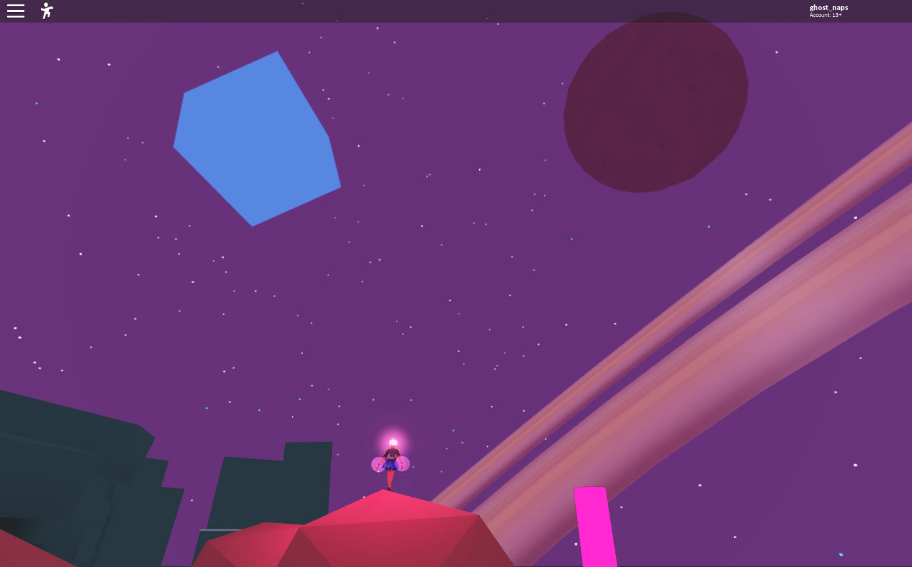
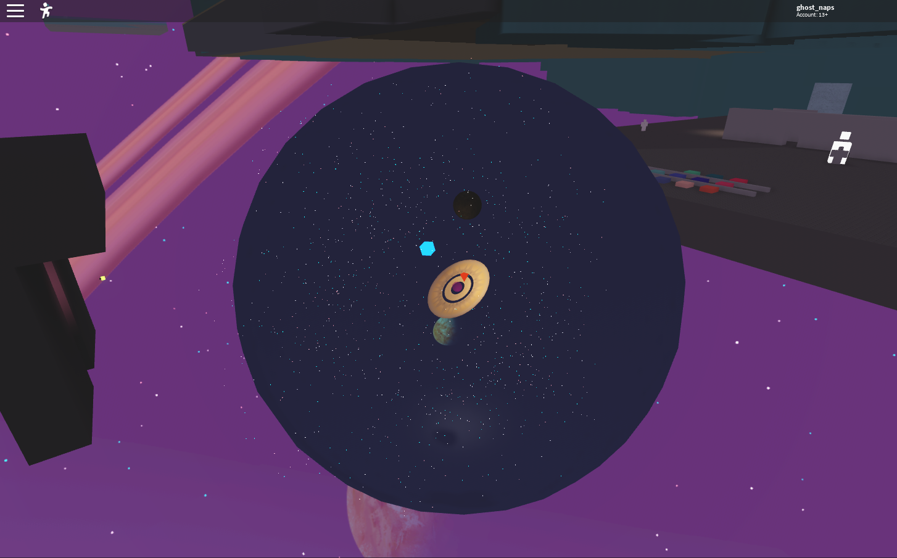

# ViewportSkybox

[](https://github.com/vocksel/viewport-skybox/actions/workflows/ci.yml)

A Roact-based 3D skybox, modified from the [3DSkybox devforum post](https://devforum.roblox.com/t/3dskybox-a-way-to-create-more-immersive-skyboxes-for-your-game/208760).

## Installation

### Wally

Add the following to your `wally.toml`:

```
[dependencies]
ViewportSkybox = "vocksel/viewport-skybox@0.1.3"
```

### Model File

* Download a copy of the rbxm from the [releases page](https://github.com/vocksel/viewport-skybox/releases/latest) under the Assets section.
* Drag and drop the file into Roblox Studio to add it to your experience.

## Usage

```lua
local Roact = require(script.Parent.Roact)
local ViewportSkybox = require(script.Parent.ViewportSkybox)

local playerGui = game.Players.LocalPlayer.PlayerGui

local skybox = Roact.createElement(Skybox, {
	content = game.ReplicatedStorage.SkyboxModel
})

Roact.mount(skybox, playerGui, "Skybox")
```



The skybox is entirely made out of instances, which can be seen in this screenshot:


